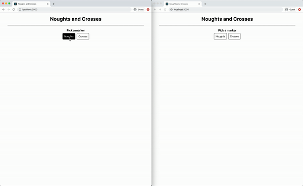

# scribble-noughts-and-crosses
A game of Noughts and Crosses written in TypeScript communicating following a Scribble protocol



## Getting started

Prerequisites:
* Node.js
  * `brew install node` or equivalent
* TypeScript
  * `npm i -g typescript`

Install packages:
```bash
# Server
cd server/
npm install

cd ../

# Client
cd client/
npm install
```

## Usage
Open a separate terminal for the Game Client and Game Server.

1. Run the server:
```bash
cd server/
npm run-script build
npm start
```

2. Run the client:
```bash
cd client/
npm start
```

3. Access `localhost:3000` on 2 separate browser windows
4. Play!

## Session Types
[Scribble](http://www.scribble.org/) protocol of game logic available as [`NoughtsAndCrosses.scr`](NoughtsAndCrosses.scr).

## Implementation
Refer to [`server/README.md`](server/README.md) and [`client/README.md`](client/README.md) for details on the generated code and user implementation.