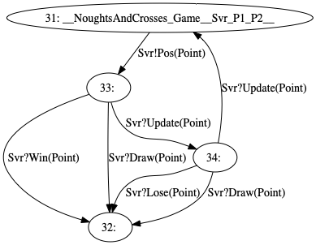

# Client

Game client written as a React application using Redux for game state management.

> For simplicity, both `P1` and `P2` roles share the same (UI) implementation, achieved by defining higher-order components to minimise the duplication. It would be perfectly reasonable to provide different implementations of `P2`.

This project was bootstrapped with [Create React App](https://github.com/facebook/create-react-app).

## Available Scripts

* `npm start`
  * Starts the development server

## Directory Structure

### `src/NoughtsAndCrosses`
This contains the session types and runtime generated from the Scribble protocol.

#### `src/NoughtsAndCrosses/Constants.ts`
Enums defined for the client roles and message labels.
Can be reused by the user in their implementation.

#### `src/NoughtsAndCrosses/Runtime.ts`

#### `src/NoughtsAndCrosses/Types.ts`
User-defined payloads __not generated by the toolchain__.

#### `src/NoughtsAndCrosses/P1/`
Encoding of states and transitions of the `P1` EFSM.

##### `src/NoughtsAndCrosses/P1/S31.tsx`
Example of a __send__ state. 

The following props are supported:

* `Pos: SendComponentFactory<Point>`
  * Parameters:
    * Event, e.g. 'Click', 'Hover'
    * Event handler - a function that consumes the `UIEvent` and returns a `Point` to send
  * Returns:
    * A React component that will invoke the event handler and send the result as a `Pos` message when the event is triggered.

##### `src/NoughtsAndCrosses/P1/S33.tsx`
Example of a __receive__ state.

Abstract methods to be implemented:
* `abstract Win(point: Point): void` - handle a `Win` message
* `abstract Draw(point: Point): void` - handle a `Draw` message
* `abstract Update(point: Point): void` - handle a `Update` message

##### `src/NoughtsAndCrosses/P1/S32.tsx`
Example of a __terminal__ state.

##### `src/NoughtsAndCrosses/P1/P1.tsx`
Session runtime, to be rendered by the user in order to instantiate the session.

The following props are supported:
* `endpoint: string`
  * URL of WebSocket server to connect to
* `states: [Constructor<S31>, Constructor<S32>, Constructor<S33>, Constructor<S34>]`
  * List of __concrete user implementations__ of each EFSM state
* `waiting: JSX.Element`
  * Component to render when the client is waiting for the server to announce that the session has began

#### `src/NoughtsAndCrosses/P2/`
Encoding of states and transitions of the `P2` EFSM, similar to above.

### `src/GameLogic/`
Client-side state management for the game written in typical [_Redux_](https://redux.js.org/) fashion.

### `src/components/Board.tsx`
Game board implemented as a React component, connected to the Redux store to access the game state and render accordingly.

### `src/components/Game/`
Contains the concrete user implementations of each EFSM state.