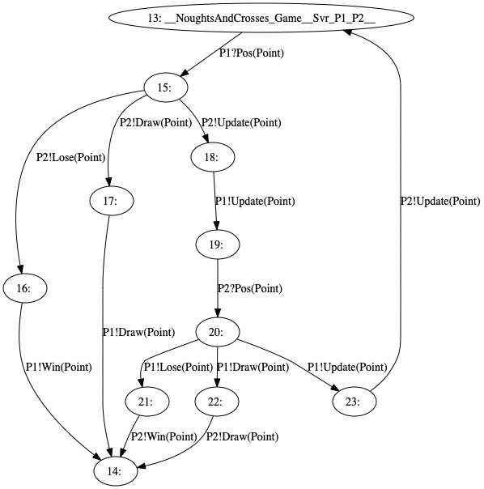

# Server
Game server written in Node.js accepting connections over WebSockets.

## Available Scripts

* `npm install`
  * Installs packages
* `npm run-script build`
  * Runs TypeScript Compiler (`tsc`) to generate JavaScript artefacts
* `npm start`
  * Starts the game server

## Directory Structure

### `src/NoughtsAndCrosses/`
This contains the session types and runtime generated from the Scribble protocol.

#### `src/NoughtsAndCrosses/Types.ts`
User-defined payloads __not generated by the toolchain__.

#### `src/NoughtsAndCrosses/EFSM.ts`
Encoding of states and transitions of the EFSM.



#### `src/NoughtsAndCrosses/Game.ts`
Session runtime with APIs selectively exposed to the user.

* `class Svr`
  * Constructor API is exposed to user
  * Waits for the client roles to initiate connection
  * When all clients have joined, creates an instance of the `_Svr` class to carry out the session communication
* `class _Svr`
  * Inner class whose APIs are __not__ exposed to the user
  * Performs the send and receive actions as described by the protocol

#### `src/NoughtsAndCrosses/Constants.ts`
Enums defined for the client roles and message labels.
Can be reused by the user in their implementation.

### `src/GameLogic.ts`
User-implemented logic for representing the game board and storing the game state.

```typescript
enum Cell { Empty, P1, P2 }
enum MoveResult { Win, Draw, Continue }

class Board {

  // Store 3x3 grid
  private _board: Array<Array<Cell>>;

  // Register P1 move and return game result
  p1(move: Point): MoveResult;

  // Register P2 move and return game result
  p2(move: Point): MoveResult;

  // Clear game board
  clear();
}
```

### `src/app.ts`
User-implemented logic for creating the session on top of the generated `NoughtsAndCrosses.Svr` class.

```typescript
// Create WebSocket server on top of Express.js app
const app = express()
const server = http.createServer(app)
const wss = new WebSocket.Server({ server })

// Define handlers for session construction
const handle_P1: Receive_P1 = {
  // Handle incoming {Pos(Point)} message
  Pos: (move: Point) => {
    // Record the move
    const result = board.p1(move)

    // Send message depending on result
    switch (result) {
      case MoveResult.Win: ...
      case MoveResult.Draw: ...
      case MoveResult.Update: ...
    } 
  }
}

// Defined similarly
const handle_P2: Receive_P2 = ...

// Instantiate session
new NoughtsAndCrosses.Svr(wss, handle_P1, handle_P2)

// Listen for incoming connections
server.listen(PORT, () => console.log(`Listening on port ${PORT}`))
```